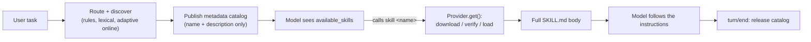

# dsh-skillflux

Dynamic Skill Runtime Manager for
[DeepSeek Harness](https://github.com/deepseek-ai/deepseek-harness).

SkillFlux keeps the full Skill pool outside the model-facing catalog. For each
task, it selects a small set of relevant Skills, mounts them for the current
turn, and releases the mounts when the turn ends.

When the local pool has no good match, SkillFlux can search skills.sh and the
public GitHub `SKILL.md` corpus live, then rank candidates with relevance-first
quality and 30-day repository activity signals before proposing a pinned mount.

> **Status:** v0.2 for DeepSeek Harness `0.1.1-rc.2`. Harness is still a
> developer preview, so this project follows the current RC API.

[中文文档](README.zh-CN.md)

## Why SkillFlux

A growing Skill library should not make every request carry a growing catalog.
Large catalogs consume context and make Skill selection less predictable.

SkillFlux acts as a runtime layer between the Agent and its Skill pool. The
automatic catalog contains no more than `maxActiveSkills` selected Skills
(three by default), while the official DSH Skill Registry remains the source
of truth. Explicit `/skill-name` invocations remain available separately.

## Quick start

You need Node.js `22.20.0` or later and a DeepSeek Harness profile on the
`0.1.1-rc.2` package line.

1. Install SkillFlux into the profile you use:

   ```bash
   dsh plugin --profile web add github:YiyuZh/dsh-skillflux
   ```

   Replace `web` with another profile name, such as `headless`, when needed.

2. Restart that Harness profile.

3. Verify the runtime from a DSH conversation:

   ```text
   /skillflux status
   ```

For a reproducible deployment, pin a commit:

```bash
dsh plugin --profile web add github:YiyuZh/dsh-skillflux#<commit-sha>
```

The repository includes built `lib/` artifacts, so GitHub installation doesn't
run a `prepare` script. The bundle patch disables the official `tool-skill`
consumer and mounts SkillFlux under the unique `skillflux` loader ID. It keeps
the official `skill` Registry and `skill-filesystem` provider active.

## How it works

```text
User task
  -> ordered rules + deterministic lexical router (English and Chinese)
  -> optional usage-based tie-breaking and embedding fallback
  -> local Registry + persistent cache + adaptive online discovery
  -> relevance-first quality ranking with 30-day activity signals
  -> publish 1..maxActiveSkills metadata summaries through a Skill provider
  -> Registry skills mount eagerly; cached and remote bodies stay lazy
  -> Agent calls the `skill` tool for the exact listed name
  -> the provider downloads, verifies, and loads that body on demand
  -> turn/end releases the shortlist and provider catalog
  -> retain or prune downloaded files by age, size, and observed value
```



The model-facing catalog carries summaries only. A cached or remote body is
downloaded, SHA-256 verified against its immutable commit, and loaded only
when the model actually calls `skill`. Registry skills mount eagerly because
their bodies are already local. Every published candidate is scoped to the
receiving Agent; releasing a turn removes it from future catalogs without
deleting cached files or text already stored in session history.

## Capabilities

- Route by ordered rules, then deterministic English and Chinese lexical scores.
- Optionally use successful Skill loads as a small, decaying ranking boost for
  candidates that already pass the lexical relevance threshold.
- Optionally fill unmatched catalog slots with semantic similarity from a local
  Ollama or OpenAI-compatible embedding endpoint.
- Limit the model-facing catalog with `maxActiveSkills`.
- Optionally enforce a conservative estimated-token budget for the Skill
  catalog prompt.
- Discover candidates from the DSH Registry, the SkillFlux cache,
  [skills.sh](https://skills.sh/), and authenticated GitHub `SKILL.md` code
  search.
- Re-rank remote matches by task relevance, marketplace adoption, repository
  activity, stars, forks, license metadata, content provenance, and configured
  owner policy. Every result carries an explainable evidence level and warnings.
- Resolve remote candidates to immutable GitHub commit SHAs.
- Publish metadata-only summaries through one host-level Skill provider whose
  candidates resolve per Agent; cached and remote bodies load lazily on the
  `skill` call.
- Verify cached content with a SHA-256 manifest before every load.
- Adapt online discovery to local confidence: a confident local shortlist
  fills every catalog slot without network traffic, while partial local hits
  automatically fill the remaining slots from skills.sh and GitHub.
- Track per-source health with consecutive-failure cooldowns so a failing
  provider is skipped instead of retried every turn, and keep last-good
  catalogs through non-authoritative observations when discovery degrades.
- Automatically prune idle and low-value installed Skill cache entries while
  protecting active and in-flight mounts.
- Support per-remote-mount, per-repository/session, and automatic approval
  policies.
- Expose model tools for loading, searching, and mounting Skills.
- Expose `/skillflux` commands for status, routing explanations, usage, and
  cache cleanup.

## Routing behavior

SkillFlux routes a task in this order:

1. Preserve an explicit user invocation such as `/pdf-reader` and exclude that
   name from automatic routing.
2. Group model-invocable Registry and cached candidates by Skill name. Registry
   entries represent a name first, while same-name cache entries remain
   available as fallbacks.
3. Apply matching `routes` in configuration order.
4. Score the remaining name representatives with deterministic lexical
   matching and reject scores below `minRouteScore`.
5. When `adaptiveRouting` is enabled, add a bounded, time-decaying usage boost
   only to candidates that already passed `minRouteScore`. Rules keep priority,
   and history cannot make an irrelevant candidate cross the threshold.
6. In `hybrid` mode, use embeddings only when rules and lexical matching leave
   catalog slots unfilled. Semantic results never displace those earlier matches.
7. Publish the selected names until `maxActiveSkills` is reached. Registry
   names mount eagerly; cached and remote names stay metadata-only and their
   bodies load lazily when the model calls `skill`. When `catalogTokenBudget`
   is enabled, skip a candidate that would make the estimated catalog prompt
   exceed that budget. A lazy load that fails tries its same-name fallbacks in
   candidate-pool order under one shared install deadline.

The lexical score is:

| Match | Score |
| --- | ---: |
| Complete Skill name or its space-separated form | +100 |
| Each matching name token | +20 |
| Each matching `whenToUse` token | +8 |
| Each matching description token | +3 |

For equal scores, Registry candidates rank before cached candidates, and cached
candidates rank before remote candidates. Cache ties prefer higher install
counts and then a stable source/name order.

Semantic fallback uses cosine similarity, filters results below
`minEmbeddingSimilarity`, and reports a rounded 0-100 score. It runs only after
the ordered rule and lexical stages.

## Online quality discovery

Remote discovery is live, not a bundled catalog:

1. skills.sh supplies marketplace matches and install counts.
2. When `GITHUB_TOKEN` or `GH_TOKEN` is available, GitHub Code Search finds
   matching public `SKILL.md` files outside the marketplace. SkillFlux fetches
   and validates each matched frontmatter before accepting it.
3. GitHub repository metadata supplies the immutable HEAD commit, stars,
   forks, license, archive state, owner type, and last push time.
4. SkillFlux rejects zero-relevance, archived, disabled, below-star, and
   below-quality candidates, then applies the configured evidence policy.
5. Exact duplicate candidate identities are collapsed. Equal root `SKILL.md`
   hashes in different repositories remain separate because adjacent resources
   may differ; they are not treated as independent provider corroboration.

The quality score is capped at 100. Relevance is a gate and the largest single
component, so a famous but unrelated repository cannot outrank an exact new
match merely because it has more stars.

| Signal | Maximum contribution |
| --- | ---: |
| Task/name/description relevance | 55 |
| skills.sh installs | 15 |
| GitHub stars | 15 |
| GitHub forks | 5 |
| Repository activity, with the configured recent window worth most | 10 |
| Trusted owner, organization ownership, and license metadata | 15 |
| Cross-source discovery and a pinned GitHub content preview | 8 |

`remoteRecentActivityDays` defaults to 30. Activity inside that window receives
the full freshness contribution; older maintained projects decay gradually
instead of being discarded. Add owners you have independently vetted to
`remoteTrustedOwners`; being an organization or having many stars is not itself
treated as verification.

Each candidate is labeled `unverified`, `community`, `corroborated`, or
`trusted`. The default `remoteTrustPolicy: community` accepts a directly
previewed and content-pinned GitHub Skill even when it is new and has few stars,
but exposes `low-adoption`, missing-license, stale-activity, and source-coverage
warnings. `corroborated` requires both a pinned content preview and discovery by
multiple providers. `trusted` means only that the repository owner appears in
your explicit `remoteTrustedOwners` list; it is not a security certification.
Use `remoteBlockedOwners` for an explicit deny list. An owner cannot be both
trusted and blocked.

These controls are re-applied to installed SkillFlux cache entries on every
search, automatic route, and mount. Removing an owner from
`remoteTrustedOwners` therefore revokes its stored `trusted` label; adding it to
`remoteBlockedOwners` prevents reuse after a restart. Legacy cache manifests
without an evidence label are treated as `community` because their immutable
commit and installed-directory hash are known, but they do not satisfy
`corroborated` or `trusted` policies.

GitHub code search requires authentication. Start DSH from a shell that exposes
one of the standard variables, for example in PowerShell:

```powershell
$env:GH_TOKEN = gh auth token
dsh web
```

Without a token, SkillFlux continues to search skills.sh and enrich those
results through the public GitHub REST API. It simply skips the broader GitHub
code-search provider.

### Discovery result cache

Successful online searches are cached across DSH restarts. The default five-
minute TTL avoids repeated marketplace and GitHub API calls for the same task.
After the TTL, SkillFlux queries the providers again. If that refresh fails, it
may reuse the prior immutable candidates for an additional 24 hours; an explicit
caller cancellation never falls back to stale data.

The cache key is a SHA-256 fingerprint of the bounded normalized query and the
active discovery/ranking configuration. User task text, tokens, and Skill bodies
are not persisted. Candidate metadata remains pinned to the commit originally
validated, so stale fallback affects ranking freshness rather than source
integrity or approval identity.

The evidence-aware cache document is versioned. Older ranking-cache formats
are discarded and rebuilt online instead of being interpreted under newer
trust semantics.

The cache is stored atomically at
`$DSH_HOME/storages/skillflux/remote-discovery.json`, limited to 100 entries by
default, and hard-capped at 4 MiB. Set `remoteCacheTtlMs: 0` to disable it.

### Adaptive online discovery

With `remoteDiscovery: automatic`, SkillFlux only goes online when it needs
to. A confident local shortlist that fills every catalog slot skips remote
traffic entirely. When local routing leaves slots unfilled or finds nothing,
SkillFlux searches skills.sh and GitHub to fill the remaining slots up to
`maxActiveSkills` and `remoteAutoMountLimit`.

Each provider carries health state. After
`remoteHealthFailureThreshold` consecutive failures a source enters a
`remoteHealthCooldownMs` cooldown and is skipped, so an outage degrades to the
healthy sources plus the discovery cache instead of being retried on every
turn. A successful call clears the source's failure history. When discovery
degrades or falls back to stale cached candidates, the published catalog is
marked non-authoritative; the registry keeps its last-good catalog while the
still-usable candidates remain visible. `/skillflux status` reports failure
counts and degraded state per provider.

### Installed Skill cache governance

Downloaded Skills live separately under `$DSH_HOME/cache/skillflux`. After a
remote Skill mounts successfully, SkillFlux evaluates this installed cache and
checks it again after that session's turn releases its mounts. It removes
entries that have been idle for 90 days by default. If the remaining pool still
exceeds 100 entries or 512 MiB, it evicts the lowest-value entries first using
successful Skill tool uses, mounts, last activity, quality score, and adoption as
deterministic evidence.

Usage from the initial remote candidate and later cached candidate is aggregated
by immutable cache ID. This joins their changing candidate IDs without sharing
value between different commits of the same Skill. Legacy records without a
cache ID apply only to the newest matching repository/Skill version. Updates to
the shared usage file are locked and merged across Harness processes. Active
mounts and concurrent cache loads are protected across Service instances and
Harness processes that share a `DSH_HOME`. Lease heartbeats bound orphan-marker
retention if a crashed process ID is reused, while a process-local live-lease
registry lets hot-reloaded Service instances reclaim retired markers. Automatic
governance failures only log a warning; a compromised coordination lock fails
the current cache operation instead of continuing without mutual exclusion.

Run `/skillflux cache prune` to apply the same policy immediately. Set
`cacheAutoPrune: false` to disable automatic runs, or `cacheMaxIdleDays: 0` to
disable age-based eviction while retaining entry and byte limits. When
`usageTracking` is off, governance conservatively falls back to installation
time and immutable discovery metadata because no local usage evidence exists.
Directories with an invalid manifest are excluded from automatic deletion,
reported by `/skillflux status`, and can be removed explicitly with
`/skillflux cache clean all`.

## Configuration

SkillFlux accepts these plugin options:

```yaml
maxActiveSkills: 3
minRouteScore: 8
approvalPolicy: always       # always | session | automatic; gates lazy remote activation and explicit mounts
remoteDiscovery: automatic   # automatic (adaptive) | on-demand | off
remoteProviders: [skills.sh, github]
remoteSearchLimit: 5
remoteAutoMountLimit: 3      # max remote candidates published for lazy activation; 1 disables fallback
remoteSearchTimeoutMs: 30000
remoteMinQualityScore: 35     # 0-100
remoteMinStars: 0
remoteRecentActivityDays: 30
remoteTrustPolicy: community  # open | community | corroborated | trusted
remoteTrustedOwners: []       # e.g. [anthropics, openai, vercel-labs]
remoteBlockedOwners: []
remoteCacheTtlMs: 300000                  # 0 disables
remoteCacheStaleIfErrorMs: 86400000       # additional stale window
remoteCacheMaxEntries: 100
remoteHealthFailureThreshold: 3           # consecutive failures before a source is degraded
remoteHealthCooldownMs: 60000             # degraded source skip window
cacheAutoPrune: true
cacheMaxEntries: 100
cacheMaxTotalBytes: 536870912              # 512 MiB across installed Skills
cacheMaxIdleDays: 90                       # 0 disables idle eviction
catalogDescriptionMaxLength: 160
catalogTokenBudget: 0              # 0 disables; otherwise 64-1000000
maxSkillFiles: 1000
maxSkillBytes: 10485760
installTimeoutMs: 300000
routerMode: lexical                # lexical | hybrid
embeddingProvider: ollama          # ollama | openai-compatible
embeddingEndpoint: http://127.0.0.1:11434/api/embed
embeddingModel: embeddinggemma
embeddingApiKeyEnv: SKILLFLUX_EMBEDDING_API_KEY
embeddingTimeoutMs: 5000
embeddingCandidateLimit: 128
embeddingCacheSize: 512
minEmbeddingSimilarity: 0.45
usageTracking: true
usageMaxEntries: 1000
adaptiveRouting: false
adaptiveMaxBoost: 6
adaptiveMinUses: 2
adaptiveHalfLifeDays: 30
mcpDiscovery: automatic        # automatic | off; gates registered MCP Skills sources
mcpTrustedServers: []          # host-assigned labels allowed trusted evidence
mcpBlockedServers: []          # host-assigned labels whose skills are always refused
routes: []
```

Add ordered rules when a known task must prefer specific Skills:

```yaml
routes:
  - matchAll: [pdf, analyze]
    skills: [pdf-reader, document-parser]
  - matchAny: [react, frontend]
    skills: [react-specialist]
```

A rule can contain `matchAll`, `matchAny`, or both. Rule results keep their
declared order, skip unavailable Skills, and still respect
`maxActiveSkills`.

### Hybrid embedding router

Embedding routing is opt-in. The recommended private setup uses Ollama:

```bash
ollama pull embeddinggemma
```

```yaml
routerMode: hybrid
embeddingProvider: ollama
embeddingEndpoint: http://127.0.0.1:11434/api/embed
embeddingModel: embeddinggemma
```

For an OpenAI-compatible embedding service, select the protocol and point at
its exact embeddings endpoint:

```yaml
routerMode: hybrid
embeddingProvider: openai-compatible
embeddingEndpoint: https://provider.example/v1/embeddings
embeddingModel: provider-embedding-model
embeddingApiKeyEnv: SKILLFLUX_EMBEDDING_API_KEY
```

Set the named environment variable in the process that launches DSH. SkillFlux
never stores that value. Candidate vectors are kept in a bounded in-memory LRU
and disappear when the plugin stops. An unavailable, malformed, timed-out, or
reconfigured embedding endpoint fails open to the lexical result.

### Usage statistics and adaptive routing

Usage tracking records successful mounts and successful `skill({ name })`
loads by exact candidate ID. It is enabled by default, while adaptive routing
is opt-in:

```yaml
usageTracking: true
adaptiveRouting: true
adaptiveMaxBoost: 6
adaptiveMinUses: 2
adaptiveHalfLifeDays: 30
```

Records are stored atomically in
`$DSH_HOME/storages/skillflux/usage.json` (normally
`~/.dsh/storages/skillflux/usage.json`) and bounded by `usageMaxEntries`.
The file also has a hard 2 MiB limit; least-recently-useful records are evicted
first when either bound is reached.
SkillFlux stores only the candidate ID, Skill name, origin, source, counters,
token counts, and timestamps. It does not store task text, Skill instructions,
or resources.

The boost is capped by `adaptiveMaxBoost`, requires at least
`adaptiveMinUses` successful loads, and halves after
`adaptiveHalfLifeDays` without use. A telemetry read or write failure falls
open to normal routing. Set `usageTracking: false` to disable persistence; in
that case `adaptiveRouting` must also remain false.

### Token telemetry

When the host mounts the DSH token-meter service, SkillFlux prices the catalog
entry lines and each loaded SKILL.md body with the native estimator. When the
service is absent, it falls back to the same portable estimate the catalog
budget uses (`ceil(UTF-8 bytes / 3)`). No package dependency is added for this:
the optional `ctx.tokenMeter` service is resolved at runtime and any failure
degrades silently to the portable estimate.

Per-skill token counts are appended to the usage records and shown by
`/skillflux status` and `/skillflux usage`: the catalog footprint at the last
mount, the loaded-body tokens at the last load, and their running total, plus
which estimator produced them. Only token counts are persisted; task text,
Skill instructions, and resources never reach `usage.json`. Token telemetry is
observability only and never changes routing, approval, or pruning decisions.

### Catalog context budget

`catalogTokenBudget` is an optional second bound in addition to
`maxActiveSkills`. The default `0` keeps existing behavior. A nonzero value
preflights each mount and rejects only the candidate that would exceed the
budget, allowing later smaller or same-name fallback candidates to continue:

```yaml
maxActiveSkills: 3
catalogDescriptionMaxLength: 160
catalogTokenBudget: 512
```

The estimate covers the complete replacement-form Skill catalog prompt after
description truncation. It uses `ceil(UTF-8 bytes / 3)`: intentionally
conservative for typical English and close to one token per CJK character, but
it is not a model-specific tokenizer result. `/skillflux status` reports the
current estimate and `/skillflux explain` marks rejected candidates as
`budget-skipped`.

### Approval policies

| Policy | Behavior |
| --- | --- |
| `always` | Request native DSH approval for every remote mount. This is the default. |
| `session` | Request approval for the first successful install from a repository, then trust that repository for the current session. |
| `automatic` | Try ranked remote candidates until one mounts, without approval. Use only in a trusted environment. |

If approval is unavailable, rejected, or canceled, the remote mount fails
closed.

### Automatic remote fallback

With `approvalPolicy: automatic`, a broken first result no longer blocks a
usable second result. SkillFlux tries at most `remoteAutoMountLimit` candidates
in discovery order (default **3**, allowed **1–5**), stopping after the first
successful mount. Set it to `1` for single-candidate behavior.

All attempts share one `installTimeoutMs` deadline, starting after discovery.
The next candidate is not started after this deadline, explicit cancellation,
or turn cleanup. In-flight lock acquisition and cleanup are awaited safely;
the deadline is not a strict wall-clock bound on their completion.

Every attempt still enforces current trust/owner policy, pinned-source
verification, installed-content integrity, and catalog limits.
`/skillflux explain` records `mount-failed`, `mount-timeout`, `budget-skipped`, or `mounted`.
Failed candidates are removed from this turn's hint; unattempted candidates
remain available. A new `skillflux_search` can retry a failure; failures are not
persisted as a blacklist. `always`, `session`, and explicit `skillflux_mount`
keep their existing approval behavior and never silently switch candidates.

### MCP Skills sources

SkillFlux can serve skills published over the Model Context Protocol Skills
extension (`io.modelcontextprotocol/skills`, SEP-2640). A transport-agnostic
`McpSkillsClient` speaks `skills/list`, `skills/get`, and `resources/read` over
any injected transport; the host assigns each source a stable label, which is
the origin half of every skill identity:

```ts
import { McpSkillsClient, McpTransport } from 'dsh-skillflux'

const transport: McpTransport = { request: (method, params) => rpc(method, params) }
ctx.skillFlux.registerMcpSource('docs-server', new McpSkillsClient(transport))
```

Listings flow through the same trust and approval boundaries as remote
candidates. Every entry is validated against the extension contract, a skill
whose `resources` is `"dynamic"` is refused because it cannot be content-bound,
and approvals bind to the sorted `[uri, digest, size]` set. Files are fetched
lazily through `resources/read`, digest- and size-verified, frontmatter-verified
against the entry, and materialized under a cache id that encodes the server
label, SKILL.md URI, and content-bound key; changed content lands at a fresh
id and never overwrites an approved snapshot. MCP content is always tagged with
its server label, never executes during discovery or loading, and never
silently shadows a same-named skill from another origin. A source that cannot
be listed fails open for that turn and is reported as non-authoritative.

## Model tools and user commands

The model can use:

- `skill({ name })` to load instructions for a Skill already mounted this turn.
- `skillflux_search({ query, remote? })` to search installed, cached, and
  immutable remote candidates. Remote results include score components,
  evidence level, positive signals, and warnings.
- `skillflux_mount({ candidateId })` to mount a candidate from the current
  SkillFlux discovery state.

You can use:

```text
/skillflux status
/skillflux explain
/skillflux usage
/skillflux cache list
/skillflux cache prune
/skillflux cache clean <cache-id>
/skillflux cache clean all
/skillflux discovery-cache status
/skillflux discovery-cache clean
```

`explain` shows each candidate's router stage, score, base score, adaptive
boost, and whether it was selected, successfully mounted, or skipped by the
catalog budget.

Cleanup and governance skip cache entries that are mounted or being loaded. At
`turn/end`, SkillFlux unregisters runtime mounts; installed files remain
available until a later policy run or explicit cleanup removes them.

## Security and trust

- Remote discovery accepts only public GitHub repositories from skills.sh or
  authenticated GitHub `SKILL.md` code search.
- GitHub-discovered `SKILL.md` files are read from the immutable commit through
  the authenticated GitHub Contents API, bounded to 256 KiB, and must pass the
  same supported frontmatter parser before they become candidates.
- Before every new installation, SkillFlux enumerates up to 512 `SKILL.md`
  files at the pinned commit through the GitHub tree API, reads their exact
  tree-bound blob SHAs through the Git Blob API, and requires exactly one usable
  Skill with the requested name. It then selects only the regular files under
  that Skill directory. This applies to skills.sh-only results as well as GitHub
  Code Search results; `raw.githubusercontent.com` is not required.
- The verified source SHA-256 must match both a prior GitHub search preview (if
  present) and the `SKILL.md` selected by the installer. Same-name files at
  multiple repository paths are therefore rejected even when their root bytes
  match, because adjacent resources may differ.
- Equal root-file hashes across repositories are not collapsed or described as
  mirrors without a complete Skill-directory hash.
- Archived and disabled repositories are rejected. Repository popularity,
  activity, and license metadata are ranking evidence, not a security verdict.
- `remoteTrustPolicy` is an evidence threshold, not a malware scanner. A
  `trusted` label reflects only the current locally configured owner allowlist;
  the threshold and blocked-owner list also govern reuse from the installed
  SkillFlux cache.
- Each remote result is resolved to a 40-character commit SHA before SkillFlux
  creates its candidate ID.
- The built-in installer fetches only those selected Git blobs, validates each
  response's declared size and recomputed Git blob SHA, and writes them as
  non-executable regular files. It does not download or extract the whole
  repository archive.
- File-count and byte limits are checked from the pinned tree before download
  and checked again from disk. The default limits are 1,000 files and 10 MiB.
- SkillFlux checks paths, symlinks, frontmatter, file counts, byte counts, and a
  SHA-256 content manifest before mounting.
- SkillFlux caches scripts as resources but never executes them.
- Automatic discovery sends a bounded keyword query instead of the complete
  user message.
- Hybrid routing sends at most 1,000 characters of the direct task and at most
  1,000 characters of each candidate's name, `whenToUse`, and description to
  the configured embedding endpoint. It never sends Skill bodies or resources.
- Usage records never include task text or Skill content and are bounded to
  `usageMaxEntries` entries in the DSH storage directory.
- Installed-cache governance reads only those bounded usage counters plus
  immutable cache metadata; it never inspects or stores task text.
- The remote discovery cache persists only a query/configuration fingerprint and
  bounded, validated candidate metadata. It never stores the query text or API
  credentials.
- MCP Skills sources are addressed by a host-assigned label, never by the
  server's self-reported name. Entries are validated before they become
  candidates, `"dynamic"` skills are refused, and every loaded byte is checked
  against the held `[uri, digest, size]` set plus a field-by-field frontmatter
  comparison. Approvals bind to that content set; a changed set lands at a new
  cache id and requires fresh approval. Cached MCP files are re-digested on
  every load and never acquire filesystem-skill trust.
- `GITHUB_TOKEN` or `GH_TOKEN` is optional. It enables broad GitHub code search
  and batched repository enrichment; SkillFlux doesn't persist it.

Skills are external instructions and can be malicious. Approval is a trust
decision, not a sandbox. Keep DSH permissions, sandboxing, and tool approvals
enabled.

Approval also guards lazy activation. A published remote candidate downloads
nothing until the model calls `skill`; the same configured policy is applied at
that boundary, immediately before download. When no approval channel is
available, the call fails closed rather than installing without consent.
Blocked or under-threshold owners never reach the published catalog.

## Evaluation

Run the versioned routing corpus without an API key or network access:

```bash
corepack pnpm eval
```

The suite contains 40 lexical cases, 4 adaptive safety cases, 8
provider-independent semantic-vector cases, 7 catalog-budget cases, 8
remote-quality pairwise cases, 8 remote evidence-governance cases, 7 remote-cache
policy cases, 8 lazy remote-fallback cases, 7 installed-cache governance cases,
7 provider-native lazy-runtime cases, and 12 MCP source entry-contract cases
covering English, Chinese, normalization, rules, thresholds, capacity, ranking,
content deduplication,
semantic top-k, context budgets, freshness, evidence policy, adoption, cache
expiry, value-aware eviction, active-mount protection, and negative rejection.

| Metric | Current baseline |
| --- | ---: |
| Exact ordered match | 100.0% |
| Top-1 accuracy on positive cases | 100.0% |
| Negative-task rejection | 100.0% |
| Selector-limit compliance | 100.0% |
| Semantic exact ordered match | 100.0% |
| Semantic positive Top-1 | 100.0% |
| Semantic negative rejection | 100.0% |
| Remote-quality pairwise ordering | 100.0% |
| Remote evidence-governance boundaries | 100.0% |
| Remote-cache policy boundaries | 100.0% |
| Installed-cache governance boundaries | 100.0% |
| MCP source entry contract | 100.0% |

These results verify the deterministic router and vector-ranking contracts
against checked-in inputs. The semantic vectors are synthetic, so these results
do not measure a particular embedding model, third-party Skill quality, or the
final answer from an online model. Read the
[evaluation corpus guide](evals/README.md) for the case format and limitations.

## Migrating from v0.2

v0.3 turns SkillFlux into a provider-native lazy runtime. Most configuration
carries over unchanged; the differences are behavioral:

- Automatic routing no longer downloads remote candidates. It publishes
  metadata summaries; the body downloads, verifies, and loads only when the
  model calls `skill`. `remoteAutoMountLimit` now bounds how many remote
  candidates are published for lazy activation (1 disables same-name
  fallback) rather than how many are installed eagerly.
- Registry skills still mount eagerly. Cached and remote skills appear in the
  catalog as summaries and load on demand.
- Approval applies at lazy activation too. Under `always` or `session`, the
  first `skill` call for a remote candidate asks before downloading.
- Remote discovery is adaptive: a confident local shortlist skips the
  network, partial local hits fill the remaining slots, and failing sources
  cool down instead of being retried every turn. Degraded or stale discovery
  publishes a non-authoritative observation so last-good catalogs survive
  outages.
- Routing traces gain a `loaded` outcome for successful lazy loads.
- The official DSH `tool-skill` consumer is disabled by the bundle patch in
  favor of SkillFlux's filtered catalog.

## Known limitations

- Hybrid quality depends on the configured embedding model. SkillFlux does not
  download or manage that model.
- SkillFlux registers one host-level provider: a scoped agent context does not
  expose `ctx.skills`, so per-agent catalogs resolve through the lookup scope
  passed by the registry.
- Semantic fallback considers at most `embeddingCandidateLimit` local
  candidates in current Registry/cache order.
- MCP loading ships the transport-agnostic JSON-RPC client and the in-process
  test transport. Stdio/SSE adapters are consumer-provided for now, and skills
  whose `resources` is `"dynamic"` are refused because they cannot be
  content-bound.
- Catalog token counts are portable estimates, not exact counts from the
  configured chat model. They exclude loaded Skill bodies, tool schemas, and
  other session history.
- GitHub Code Search is unavailable without `GITHUB_TOKEN` or `GH_TOKEN`; the
  skills.sh provider remains available.
- Quality scoring is evidence-based triage, not a code audit. Inspect the exact
  pinned candidate and keep approval/sandbox controls enabled before mounting.
- During a provider outage, stale fallback can temporarily return older ranking
  evidence for the configured window, though every candidate remains pinned to
  its previously validated immutable commit.
- Unmounting can't remove text already committed to session history.
- A new upstream commit creates a new immutable cache entry. Value-aware
  governance may retain multiple versions until they become idle or exceed a
  configured limit.

## Development

External contributors should follow [CONTRIBUTING.md](CONTRIBUTING.md) for the
fork, topic-branch, offline quality-gate, live GitHub discovery test, evaluation,
and pull-request review workflow.

```bash
corepack pnpm install
corepack pnpm check
corepack pnpm eval
corepack pnpm test:cache-governance-live
corepack pnpm test:discovery-live
corepack pnpm test:embedding-live
corepack pnpm pack --dry-run
```

`test:discovery-live` runs a real skills.sh query, also uses GitHub Code Search
when `GITHUB_TOKEN` or `GH_TOKEN` is present, and verifies that the identical
second query is served from the persistent discovery cache. Override the task with
`SKILLFLUX_DISCOVERY_QUERY`, add comma-separated trusted owners with
`SKILLFLUX_TRUSTED_OWNERS`, blocked owners with `SKILLFLUX_BLOCKED_OWNERS`, or
override the smoke-test evidence threshold with `SKILLFLUX_TRUST_POLICY`. Set
`SKILLFLUX_REQUIRE_GITHUB=1` to fail when the GitHub provider is unavailable.

`test:embedding-live` expects the configured Ollama model to exist. Override
the defaults with `SKILLFLUX_EMBEDDING_MODEL`, `SKILLFLUX_EMBEDDING_ENDPOINT`,
and `SKILLFLUX_EMBEDDING_PROVIDER` when testing another endpoint.

The test suite covers routing, DSH catalog virtualization, explicit invocation,
remote response validation, discovery-cache expiry/fallback, install-cache
integrity, lifecycle cleanup, bounded usage storage, adaptive-threshold safety,
and the bundle patch. Read
[CONTRIBUTING.md](CONTRIBUTING.md) before submitting a change.

## License

[MIT](LICENSE)
